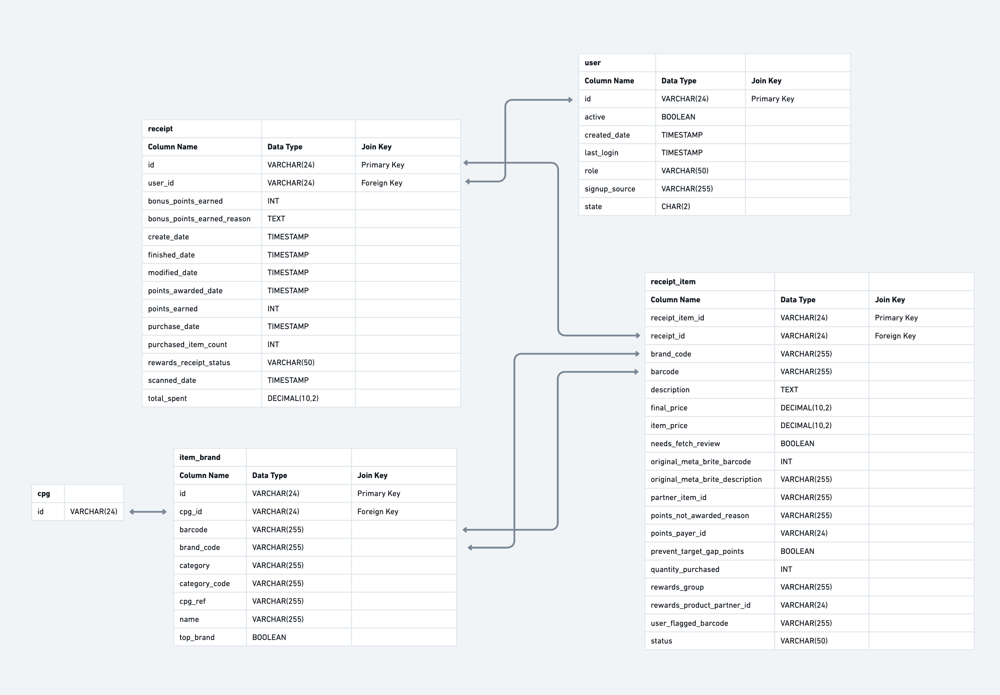

# Ray Chung - Fetch HW

## 1. Structured Relational Data Model



```
CREATE TABLE `user` (
  `id` VARCHAR(24) NOT NULL,
  `active` BOOLEAN NOT NULL,
  `created_date` TIMESTAMP NOT NULL,
  `last_login` TIMESTAMP NULL,
  `role` VARCHAR(50) NOT NULL,
  `sign_up_source` VARCHAR(255) NULL,
  `state` VARCHAR(2) NULL,
  PRIMARY KEY (`id`));

CREATE TABLE `item_brand` (
  `id` VARCHAR(24) NOT NULL,
  `barcode` VARCHAR(255) NOT NULL,
  `brand_code` VARCHAR(255) NULL,
  `name` VARCHAR(255) NOT NULL,
  `category` VARCHAR(255) NULL,
  `category_code` VARCHAR(255) NULL,
  `top_brand` BOOLEAN NULL,
  `cpg_id` VARCHAR(24) NOT NULL,
  `cpg_ref` VARCHAR(255) NOT NULL,
  PRIMARY KEY (`id`),
  INDEX `idx_brand_code` (`brand_code`));

CREATE TABLE `receipt` (
  `id` VARCHAR(24) NOT NULL,
  `user_id` VARCHAR(24) NOT NULL,
  `create_date` TIMESTAMP NOT NULL,
  `date_scanned` TIMESTAMP NOT NULL,
  `purchase_date` TIMESTAMP NULL,
  `finished_date` TIMESTAMP NULL,
  `modify_date` TIMESTAMP NOT NULL,
  `points_awarded_date` TIMESTAMP NULL,
  `bonus_points_earned` INT NULL,
  `bonus_points_earned_reason` TEXT NULL,
  `points_earned` DECIMAL(10, 2) NULL,
  `purchased_item_count` INT NULL,
  `rewards_receipt_status` VARCHAR(50) NOT NULL,
  `total_spent` DECIMAL(10, 2) NULL,
  PRIMARY KEY (`id`),
  FOREIGN KEY (`user_id`) REFERENCES `user` (`id`));

CREATE TABLE `receipt_item` (
  `id` BIGINT NOT NULL AUTO_INCREMENT,
  `receipt_id` VARCHAR(24) NOT NULL,
  `barcode` VARCHAR(255) NULL,
  `brand_code` VARCHAR(255) NULL,
  `description` TEXT NULL,
  `final_price` DECIMAL(10, 2) NULL,
  `item_price` DECIMAL(10, 2) NULL,
  `quantity_purchased` INT NULL,
  `discounted_item_price` DECIMAL(10, 2) NULL,
  `original_receipt_item_text` TEXT NULL,
  `partner_item_id` VARCHAR(255) NULL,
  `price_after_coupon` DECIMAL(10, 2) NULL,
  `user_flagged_barcode` VARCHAR(255) NULL,
  `user_flagged_new_item` BOOLEAN NULL,
  `user_flagged_price` DECIMAL(10, 2) NULL,
  `user_flagged_quantity` INT NULL,
  `needs_fetch_review` BOOLEAN NULL,
  `prevent_target_gap_points` BOOLEAN NULL,
  `points_earned` DECIMAL(10, 2) NULL,
  `points_payer_id` VARCHAR(24) NULL,
  `rewards_group` VARCHAR(255) NULL,
  `rewards_product_partner_id` VARCHAR(24) NULL,
  PRIMARY KEY (`id`),
  FOREIGN KEY (`receipt_id`) REFERENCES `receipt` (`id`),
  INDEX `idx_item_brand_code` (`brand_code`));
```

### Assumptions/Considerations
- used TIMESTAMP instead of DATE for all date fields as the values did have time data.
- used VARCHAR(24) for all id fields. This ensures storage efficiency if there is any variation in the length of the id string.
- used DECIMAL(10,2) for monetary fields to avoid floating point errors.
- used INT in all integer fields instead of SMALLINT for scalability and safety over minor storage optimization. If we never anticipate values to be over 32,627 we could use SMALLINT instead for some fields.
- we can normalize the data more to avoid redundancy, but whether or not we should do this ultimately depends on how we anticipate this data will be utilized. Some examples of normalization would be:
-- extracting category data to a categories table.
-- normalizing brands.json.gz data into 2 tables: item/product table and brand table.
-- removing cpg_ref field from brand table below

#### Users
- some rows have "signupSource" field which was not mentioned in the schema, added that as a field
- used VARCHAR(50) instead of CHAR(8) for role, as there were some rows with "fetch-staff" value as opposed to "consumer" and thus there may be other role values.

#### Brand Data
- renamed table to "item_brand" as this data is brand data on an item/product, although admittedly not the best naming but slightly less confusing than just brand.
- added cpg_ref column as there are "Cpg" and "Cog" as values for "$ref" in the sample data. Wasn't sure if it was a typo or not, but it's a lot of "Cog" to be a typo so just assuming there could be more ref values.

#### Receipt
- extracted rewardsReceiptItemList data to a separate receipt_item table, using receipt ID as foreign key
-- we might not necessarily need all the rows in the receipt_item table, really depends on use case for what this DB will be used for
- there were some "pointsEarned" values with decimal, so using DECIMAL data type could be a better option for this field. However, since the decimal values in the sample data all ended in ".0" and the majority of "pointsEarned" fields did not have a a decimal values, I went with the assumption that there would be no decimal point value points.


## 2. Queries
There are 2 files in this repository: `queries.sql` and `single_query.sql`. The former shows my initial thought process and has 3 queries, each answering 2 questions in order (i.e. #1-2, #3-4, #5-6). The latter combines all the CTEs from the 3 original queries and combines the results for a single table view that answers all 6 questions.

## 3. Data Quality Evaluation
With regards to my thought process for data quality evaluation, I would want to check the following:
- data is formatted properly (i.e. valid JSON in this case, no non-numeric values in number fields)
- no missing, invalid or inconsistent data (i.e. same user ID with different values, modified date before created date)
- no duplicate data/rows
- no orphaned data (i.e. user ID referenced in but no data on said user ID)
- check for test data

### Disclaimer
I've worked on data validations of sample data before and writing such a script can take up a lot of time. If I was tasked to do this at work nowadays I would utilize AI to do a lot of the up front code template work. Therefore for this exercise I used Gemini AI to create template code based on the following prompt:

> "Write a Python script that evaluates the three files provided to check for any data quality issues such as missing, duplicate, or inconsistent data fields, invalid formatting, and orphaned data and logs these issues to a text file."

Most of the outputted script remains untouched as it covered all my use cases, other than some renaming and reformatting I did make the following changes to the script:
- changed issues list to set as there were a lot of duplicate issues
- added checks for some missing fields that were missed
- added check to validate if users "role" value was "consumer"
- added check to see if any records had cpg JSON data with "$id" or "$ref" values but not both

You can find the script and it's output in this repository at `data_quality_checker.py` and `data_quality_report.txt` respectively.

## 4. Communicate with Stakeholders
See `email.txt` for email write-up.
I'm assuming this is written for a product or business leader that is overseeing this project to set up a relational database and has sent me sample data to look into. In general I prefer emails to be clear to read, ideally as concise as possible, and provide a clear ask for the receiver to action on. I didn't want to just send an email with a bunch of questions, so I shelved data quality issues as action items for a different team (or my team potentially) and only briefly talked about how to optimize the data and account for performance and scaling concerns in production. Other things I could've mentioned in the email (but I figured is better for a planning meeting or in a PoC):
* Checking what database we plan to use, columnar database may be a good choice as it's more efficient at analytical queries by only accessing the necessary columns.
* Better proposed indexing, using composite indexing depending on what common queries will look like, and regular index maintenance would all be helpful.
* If we expect heavy read traffic, we can set up read replicas w/ a load balancer and only use the main database for writes.
